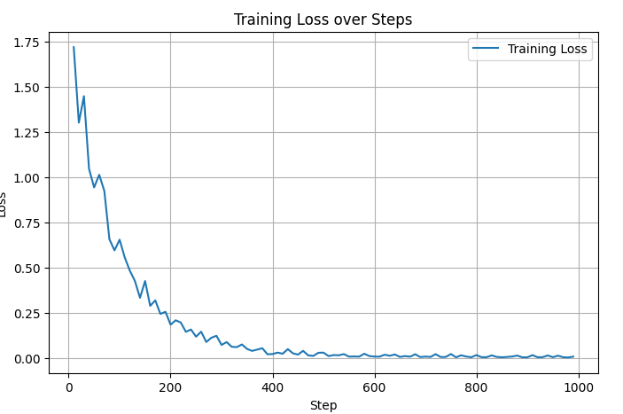

# GitHub Issues Text Classification Report

## Dataset
The dataset used for this project is the [GitHub Issues dataset](https://huggingface.co/datasets/cylee/github-issues?library=datasets) from Hugging Face.

## 1. Dataset Preparation
The original dataset contained GitHub issue bodies with associated labels, including an `unknown` label.  

- First, all rows with the label `unknown` and empty bodies were removed for training.  
- Labels with fewer than 10 samples were also removed to avoid underrepresented classes.  
- The remaining labeled issues were split into **training** and **test** sets.

## 2. Model Training
- **Model used:** sshleifer/tiny-distilbert-base-uncased. 
- **Task:** Multi-class text classification  
- **Label encoding:** String labels mapped to integer IDs  
- **Training hyperparameters:**
  - Epochs: 8  
  - Learning rate: 3e-5  
  - Batch size: 16  
  - Weight decay: 0.01  
  - Loss function: Weighted CrossEntropy

The model was trained on the training set and evaluated on the test set.

### Training Loss
  

## 3. Evaluation on Test Set
- **Accuracy:** 85%  
- **Classification report:**   
